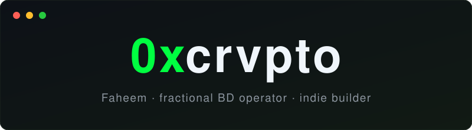

<div align="center">




**I build partnerships, products, and the systems between them.**

`web3` · `defi` · `ai` · `fintech`

</div>

---

```console
$ cat about.txt
name   : Faheem
role   : fractional BD operator / indie builder
based  : india → internet
```

---

```console
$ cat now.txt
building products at the intersection of AI, Web3, and market intelligence
```

---

```console
$ ./stats.sh
```

<div align="center">


</div>

---

<p align="center"><sub><i>build useful things · open the right doors · keep the signal high</i></sub></p>
